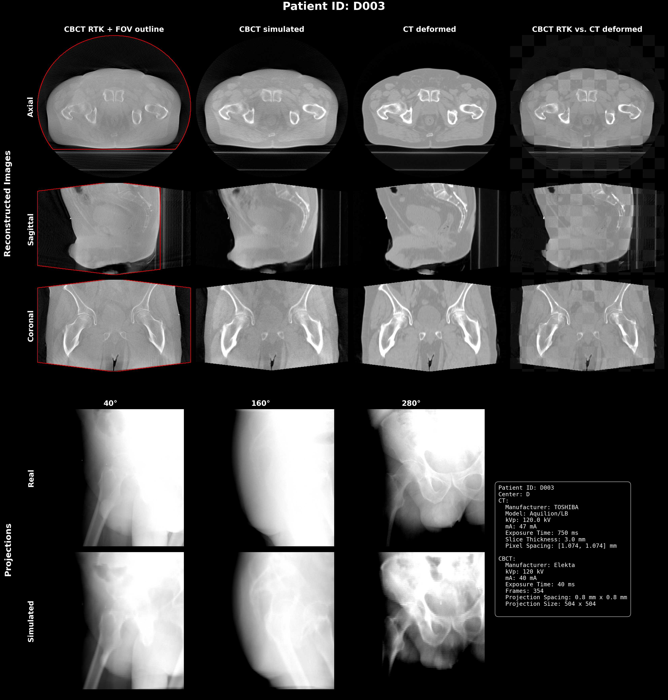

# COBRA2026 Preprocessing Pipeline

This preprocessing pipeline prepares CBCT projections and corresponding CT images for the COBRA2026 reconstruction dataset/challenge.

Currently preprocessing for Elekta and Varian CBCT systems is supported.



## Running the Preprocessing

To run the preprocessing pipeline, use the `run_preprocessing.py` script with a configuration `.yaml` file. Details about the configuration options and format can be found here: [Configuration Options](configs/README.md).

An example script to generate a configuration file can be found here: [LMU Config Generator](configs/generate_config.py).

### Usage

```bash
python3 run_preprocessing.py -c <config_file> [-d <device>] [-s <stage> ...] [options]
```

The script iterates over every patient defined in the configuration file and runs the requested stage(s) for each. If a patient fails, the error is logged and processing continues with the next patient.

#### Arguments

| Argument | Short | Description | Default |
| --- | --- | --- | --- |
| `-config_file` | `-c` | Path to the configuration `.yaml` file. | — |
| `-device` | `-d` | Device used for processing, e.g. `cpu` for CPU or `cuda:0` for GPU 0. | `cpu` |
| `-stage` | `-s` | One or more stages to run, e.g. `-s 1 2 3`. Valid stages are `0`, `1`, `2`, `3`, and `4`. | none |

#### Options

| Flag | Description |
| --- | --- |
| `--overview` | Generate an overview image only, without running the full pipeline (applies to stages 1 and 2). |
| `--skip_recon` | Skip the RTK CBCT reconstruction step. |
| `--correct_contrast_media` | Enable contrast media correction in stage 3 (requires PyTorch). |
| `--cleanup` | Delete the files generated for the given stage instead of running it (applies to stages 2 and 3). |

#### Examples

Run stage 1 on the CPU:
```bash
python3 run_preprocessing.py -c ./configs/lmu_config.yaml -d 'cpu' -s 1
```

Run stage 1 on GPU 0:
```bash
python3 run_preprocessing.py -c ./configs/lmu_config.yaml -d 'cuda:0' -s 1
```

Run several stages in sequence:
```bash
python3 run_preprocessing.py -c ./configs/lmu_config.yaml -d 'cuda:0' -s 1 2 3
```

Regenerate only the overview image for stage 1:
```bash
python3 run_preprocessing.py -c ./configs/lmu_config.yaml -s 1 --overview
```

Remove the files generated for stage 2:
```bash
python3 run_preprocessing.py -c ./configs/lmu_config.yaml -s 2 --cleanup
```

## Preprocessing Steps

The pipeline is organized into stages that build on each other. Stage 1 prepares the raw data, stage 2 deforms the CT onto the CBCT, stage 3 simulates projections from the deformed CT, and stage 4 produces the final overview. Stage 0 is a standalone reconstruction helper. Each stage skips patients whose output files already exist, so stages can be re-run safely.

**Stage 1 consists of the following pre-processing steps**:
1. Load CBCT projections, clinically reconstructed CBCT, CT, and some metadata files necessary for reconstruction (e.g geometry).
2. Apply some basic preprocessing to the CBCT projections, e.g. i0 correction, scatter correction (Varian only).
3. Perform a basic CBCT reconstruction using RTK to test if the projections and geometry are correct. Apply some image orientation corrections if necessary and align the reconstructed CBCT with the CT images (no resampling/interpolation).
4. Extract relevant metadata from CT, CBCT and projections.
5. Generate an overview .png image showing CT, clinical CBCT and reconstructed CBCT slices side by side for visual inspection.
6. Save the raw projections (without any corrections applied), the clinically reconstructed CBCT, the CT image and metadata files required for reconstruction.

**Stage 2 deforms the CT onto the reconstructed CBCT and consists of the following steps**:
1. Load the CT, clinical CBCT, reconstructed CBCT (`cbct_rtk`) and FOV mask produced by stage 1.
2. Perform a rigid registration followed by a deformable (elastix/impact) registration to align the CT with the reconstructed CBCT, producing a deformation vector field (DVF).
3. Deform the original full-FOV CT onto the CBCT grid in a single composed resample to obtain the deformed CT.
4. Postprocess the deformed CT into a virtual CT: blend it with the CBCT inside the FOV, optionally avoid bone regions and correct contrast media, and stitch the result back into the full CT outside the FOV.
5. Generate an overview .png image (checkerboard of clinical CBCT and deformed CT) for visual inspection.
6. Save the deformed CT, the masked deformed CT, the FOV mask, the DVF and the rigid transform.

**Stage 3 simulates CBCT projections from the deformed CT and consists of the following steps**:
1. Load the deformed CT and the clinical CBCT (and the rigid clinical CBCT, which defines the projector isocenter, if available).
2. Use `simcbctgenerator` to forward-project the deformed CT through the real acquisition geometry (with random patient motion), then reconstruct a simulated CBCT via FDK.
3. Copy the RTK grid information onto the simulated CBCT so it is voxel-congruent with the stage 1 reconstruction.
4. Generate overview .png images comparing the simulated CBCT to the clinical CBCT and the simulated projections to the real projections.
5. Save the simulated projections and the simulated CBCT.

**Stage 4 finalizes the dataset and consists of the following steps**:
1. Load the reconstructed CBCT, deformed CT, simulated CBCT, FOV mask and projections.
2. Generate a final overview .png image combining the reconstructed CBCT, simulated CBCT, deformed CT, FOV and real vs. simulated projections for visual inspection.

**Stage 0 is a standalone reconstruction helper** that reloads the projections and geometry saved by stage 1, re-runs the RTK reconstruction, and overwrites the reconstructed CBCT (`cbct_rtk`) and FOV mask. It is useful for re-reconstructing a patient without rerunning the full stage 1 pipeline.

## Requirements

In the docker directory a `Dockerfile` and `docker-compose.yml` file are provided to set up the required environment. The compose file defines two services: `cobra`, which runs the preprocessing pipeline, and `impact`, which provides the deformable registration server used in stage 2. The docker images can be built using the following command:

```bash
cd docker
docker compose build
```

To start a docker container modify the `docker-compose.yml` to mount your data directory and then run the following command within the docker directory:

```bash
docker compose up -d
docker exec -it cobra_preprocessing bash
```

If you only want to run the stage 1 preprocessing steps, you don't need the impact docker container and you can run:

```bash
docker compose up -d cobra
docker exec -it cobra_preprocessing bash
```


If docker is not available, the required packages can be installed locally using [`uv`](https://github.com/astral-sh/uv):

```bash
uv pip install torch torchvision --index-url https://download.pytorch.org/whl/cu128
uv pip install -r docker/requirements.txt
```
